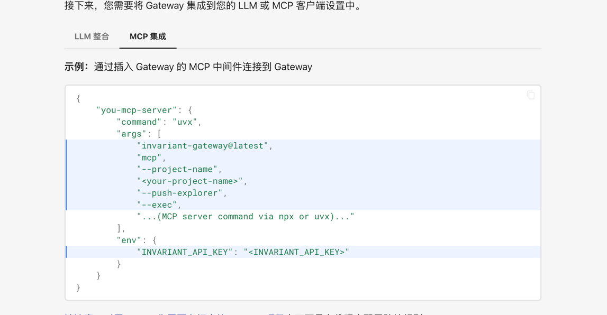

# LBS_PROJECT
This repository is for language-based security in Aarhus University

https://ieeexplore.ieee.org/document/8806751

https://github.com/langchain-ai/langchain-mcp-adapters

肯定还是想不插入的

能不能通过finetune的方法 或者加一个工具的方法使用信息流
就是一个工具/server被调用前 我能不能主动决定要不要去调用？？？

就拿个最简单的例子 
我们把label这些信息都给到LLM
我们send_email 不安全，所以我们要想办法不能让send_email发送恶意信息，
我们选择了某个工具后能不能，检查一下？？？

开发一个叫检查的工具or直接finetune模型？？？

在哪里插入 system_prompt?
比如我们就这样有个系统读取工具，可以读取信息
还有一个send_email可以leak信息

读取中被恶意中毒了，要把信息通过send_email发出去
我们对哪些东西需要打上标签？？？
读取都可以读，但是send_email要做check
why？因为send_email要往下走 所以要给他拒绝掉？？？比如把data都打上标签？？？
比如我调用了读取 同时也读取了data的

Todo：再设计一个MCP来进行拦截！！！

